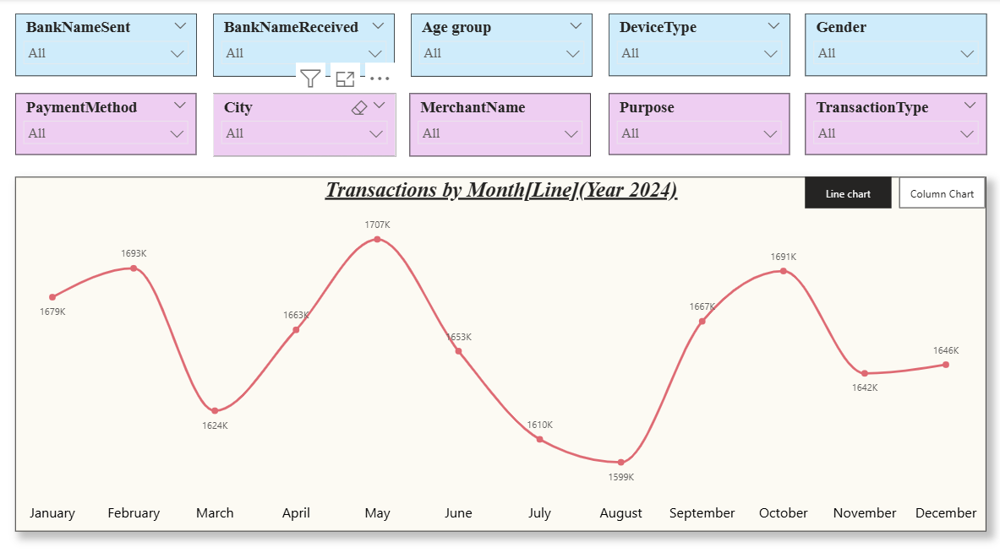

# 📊 UPI Transaction Data Analysis – Power BI Dashboard

This project presents an **interactive Power BI dashboard** that analyzes **UPI transaction data** with multiple visuals and slicers for detailed insights.

## 🚀 Project Overview

The dashboard provides insights into **monthly transactions, remaining balances, city-wise amounts, and demographic distributions** using a combination of charts, slicers, and conditional formatting.

It includes:

* **Column Chart**: Transactions by month (2024).
* **Line Chart**: Trend of transactions across months.
* **Matrix Visual**: City-wise transactions with currency and balance details.
* **Interactive Slicers**: Filter data by bank, city, payment method, merchant, device, gender, transaction type, etc.
* **Bookmarks**: Switch between views (Transactions / Remaining Balance).

## ⚙️ Steps Performed

1. **Loading Data into Power BI Desktop**
2. **Data Profiling** for quality checks.
3. **Adding Page & Age Group Columns** for categorization.
4. **Designing and Formatting Slicers** (size, position, colors).
5. **Adding Visuals**:

   * Column Chart (Monthly Transactions)
   * Line Chart (Monthly Trends)
   * Matrix Visual (City & Currency Analysis)
6. **Syncing Slicers** across pages for consistent filtering.
7. **Applying Conditional Formatting** in the matrix for better readability.
8. **Adding Bookmarks** to toggle between **Transaction Amount** and **Remaining Balance** views.

## 📷 Dashboard Snapshots

### Column Chart – Transactions by Month

### Line Chart – Monthly Transaction Trend

### Matrix Chart – City-wise Transactions

## 🛠️ Tools Used

* **Power BI Desktop** – for data modeling & visualization.

## 📌 Key Learnings

* Creating and formatting **interactive slicers**.
* Building **multi-visual dashboards** with consistent filtering.
* Using **conditional formatting** for better data interpretation.
* Implementing **bookmarks** to enhance user experience.

